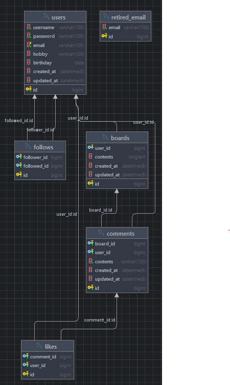

# 📰 Newsfeed Project 

## 📌 프로젝트 소개

Spring Framework의 기초를 학습하고 실습하기 위해 진행한 팀 프로젝트로, 간단한 Newsfeed 애플리케이션을 구현했습니다.

## 🗓 개발 기간 🕰

- 2025.04.07 월 - 2025.04.14 월

## 🎯 프로젝트 목적 

- Spring Boot와 JPA를 활용한 백엔드 개발 실습
- 뉴스피드 기반 일정 관리 기능 구현
- JWT 인증 및 RESTful API 설계를 통한 보안과 아키텍처 이해
- Git 기반 협업을 통한 팀 개발 경험 습득

---

## 🛠 **사용 기술 스택**

| 분야 | 기술 |
|---|---|
| **언어** | Java 17 |
| **프레임워크** | Spring Boot 3.x  |
| **빌드 도구** | Gradle |
| **ORM** | Spring Data JPA |
| **데이터베이스** | MySQL |
| **인증 방식** | JWT (JSON Web Token) |
| **문서화** | Postman *(추가 가능)* |
| **IDE** | IntelliJ IDEA |
| **버전 관리** | Git, GitHub |

---

# 📚 **8조 API 문서**

<br>

### 👨‍👩‍👦 **회원 API 명세서**
| 기능       | Method | URL                 | ✅ Request                                                                                                                            | ✅ Response                                                                                                        | Error Response                                                                                           | Status Code                                                                  |
|----------|--------|---------------------|--------------------------------------------------------------------------------------------------------------------------------------|-------------------------------------------------------------------------------------------------------------------|----------------------------------------------------------------------------------------------------------|------------------------------------------------------------------------------|
| 회원가입     | POST   | `/api/users/signup` | `{ "username": "user123","password": "securePassword123!","email": "user@example.com","birthday": "0000-00-00","hobby": "취미"}`       | `{ "id": "1", "username": "user123", "email": "user@example.com","birthday": "0000-00-00", "hobby": "취미" }`       | `400 Bad Request`: 이메일 중복, 비밀번호 형식 오류, 사용자 없음 <br> `403 Forbidden`: 기존 비밀번호 불일치 <br> `404 Not Found`: 사용자 없음, 비밀번호 불일치 | `201 Created` |
| 회원 정보 수정 | PUT    | `/api/users/{id}`   | `{ "username": "수정user123","password": "securePassword123!","email": "수정user@example.com","birthday": "1111-11-11","hobby": "수정취미"}` | `{ "id": "1", "username": "수정user123", "email": "수정user@example.com","birthday": "1111-00-00", "hobby": "수정취미" }` | `400 Bad Request`: 사용자 없음 <br> `403 Forbidden`: 기존 비밀번호 불일치 <br> `404 Not Found`: 사용자 없음, 비밀번호 불일치 | `200 Ok` |
| 비밀번호 수정  | PATCH  | `/api/users/{id}`   | `{ "oldPassword": "securePassword123!","oldPassword": "수정securePassword123!"}`                                                       | `{ "message": "Password updated successfully", "id": "1", "username": "user123", "email": "user@example.com","birthday": "0000-00-00", "hobby": "취미" }`      | `400 Bad Request`: 비밀번호 형식 오류, 사용자 없음 <br> `403 Forbidden`: 기존 비밀번호 불일치 <br> `404 Not Found`: 사용자 없음, 비밀번호 불일치 | `200 Ok` |
| 회원 탈퇴    | DELETE | `/api/users/{id}`   | 없음                                                                                                                                   |

---

### 🔐 **로그인 API 명세서**

| 이름   | Method | URL         | Request                                                                 | Response                                                                                         | Error Response                                                                                                      | Status Code |
|--------|--------|-------------|-------------------------------------------------------------------------|--------------------------------------------------------------------------------------------------|---------------------------------------------------------------------------------------------------------------------|-------------|
| 로그인 | POST   | /api/login  | `{ "email": "user@example.com", "password": "password123" }`            | `{ "id": 1, "username": "홍길동", "email": "user@example.com", "token": "eyJhbGciOiJIUzI1NiIsInR5cCI..." }` | `400 Bad Request` : 이메일 형식이 올바르지 않습니다.<br>`401 Unauthorized` : 비밀번호가 일치하지 않습니다.<br>`404 Unauthorized` : 존재하지 않는 사용자입니다. | `200 OK `   |

---

### 📃 **게시판 기능 API 명세서**
| 기능 | Method | URL                                   | ✅ Request | ✅ Response | Error Response               | Status Code                                             |
|------|--------|---------------------------------------|-----------|-----------|------------------------------|---------------------------------------------------------|
| 게시글 생성 | POST | ` /api/boards `                       | - | `[{"id":1,"contents":"contents","userId":1,"createdAt":"2025-04-11T15:49:39.991636","updatedAt":"2025-04-11T15:49:39.991656"}]` |                              | `201 Created` |
| 게시글 전체 조회 | GET | ` /api/boards `                       | `{ "pagination": 1 }` | `[{"id":1,"contents":"작성된 내용 입니다.","member_id":1,"created_at":"2025-04-07 00:00:00","updated_at":"2025-04-07 00:00:00"}, ...]` |                              | `200 Ok` |
| 게시글 선택 조회 | GET | ` /api/boards/{id} `                  | `{ "id": 1 }` | `{"id":1,"contents":"contents","userId":1,"username":"test","createdAt":"2025-04-11T15:37:17.972204","updatedAt":"2025-04-11T15:37:17.972239"}` |                              | `200 Ok`  |
| 게시글 수정 | PATCH | ` /api/boards/{id} `                  | `{ "id": 1, "member_id": 1, "contents": "contents update update" }` | `{"id":1,"contents":"contents update update","username":"test","createdAt":"2025-04-11T11:48:38.279621","updatedAt":"2025-04-11T11:48:38.279646"}` | `401 Unauthorized`: 작성 권한 없음 | `200 Ok`  |
| 게시글 삭제 | DELETE | ` /api/boards/{id} `                  | `{ "id": 1 }` | `1` | `401 Unauthorized`: 삭제 권한 없음 |                                                         |
| 전체 게시글 조회 (페이징) | GET | ` /api/boards/limit/{pagination} `    | `{ "pagination": 1 }` | `[{"id":1,"contents":"contents","userId":1,"createdAt":"2025-04-11T15:49:39.991636","updatedAt":"2025-04-11T15:49:39.991656"}]` |                              | `200 Ok` |
| 팔로우한 게시글 조회 (페이징) | GET | ` /api/boards/follower/{pagination}  ` | `{ "pagination": 1 }` | `[{"id":1,"contents":"contents","userId":1,"createdAt":"2025-04-11T15:49:39.991636","updatedAt":"2025-04-11T15:49:39.991656"}]` |                              | `200 Ok` |

---

### 🤝 **팔로우 API 명세서**

| 기능     | Method | URL              | ✅ Request               | ✅ Response                                                                                                | Error Response                                         | Status Code                                              |
|----------|--------|------------------|-------------------------|---------------------------------------------------------------------------------------------------------------|--------------------------------------------------------|----------------------------------------------------------|
| 팔로우   | POST   | `/api/follow`    | ` { "followedId": 2 } ` | ` { "id": 1, "followerEmail": "abc1@abc.com", "followedEmail": "abc2@abc.com", "message": "팔로우 되었습니다." } ` | `400 Bad Request`: 이메일 중복 <br> `404 Not Found`: 사용자 없음 | `201 Created` |
| 언팔로우 | DELETE | `/api/unfollow`  | ` { "followedId": 2 } ` | ` { "message": "언팔로우 되었습니다." } `                                                                      | `208 Already Reported`: 팔로우 중복 <br> `404 Not Found`: 사용자 없음                   | `200 OK`  |
| 팔로우 리스트  | GET    | `/api/follow/followerlist` | `토큰 필요`   | `[{ "userId": 2, "email": "abc2@abc.com" }, { "userId": 3, "email": "abc3@abc.com" }, { "userId": 4, "email": "abc4@abc.com" }]` | X | `200 OK` |
| 팔로워 리스트  | GET   | `/api/unfollow/followedlist` | `토큰 필요`  | `{ "userId": 2, "email": "abc2@abc.com" }, { "userId": 3, "email": "abc3@abc.com" }, { "userId": 4, "email": "abc4@abc.com" }` | X | `200 OK` |


---

### 🗨️ **댓글 기능 API 명세서**
| 기능    | Method | URL                                       |  ✅ Request                    | ✅ Response                                                                                                                     | Error Response                                         | Status Code                                               |
|----------------------|--------------|------------------------------------------|------------------------------|---------------------------------------------------------------------------------------------------------------------------------|--------------------------------------------------------|-----------------------------------------------------------|
| 댓글 생성            | POST         | ` /api/boards/{boardId}/comments `        |  ` { "contents": "작성할 내용" } ` | ` { "commentId": 1, "boardId": 1, "userId": 10, "userName": "김한비", "contents": "작성할 내용", "createdAt": "2025-04-11T19:52:20" } ` | `400 Bad Request`: 댓글 없음 <br> `404 Not Found`: 사용자 없음  | `201 Created` |
| 전체 댓글 조회       | GET          | ` /api/boards/{boardId}/comments `        |  없음                           | ` [ { "commentId": 1, "contents": "...", "userName": "...", ... }, {...} ] `                                                    |                                                        | `200 OK` |
| 댓글 페이지네이션 조회 | GET          | ` /api/boards/{boardId}/comments?page=0 ` | 없음                           | ` { "content": [...], "pageable": {...}, "totalPages": 3, ... } `                                                               |                                                        | `200 OK` |
| 단건 댓글 조회       | GET          | ` /api/comments/{id} `                    |  없음                           | ` { "commentId": 1, "boardId": 1, "userId": 10, "contents": "댓글", ... } `                                                       | `404 Not Found`: 댓글 없음 <br> `403 Forbidden`: 권한 없음  | `200 OK` |
| 댓글 수정            | PUT          | ` /api/comments/{id} `                    |  ` { "contents": "수정할 내용" } `   | ` { "commentId": 1, "userId": 10, "contents": "수정할 내용", "updatedAt": "2025-04-11T20:22:00" } `                                   | `400 Bad Request`: 이메일 중복 <br> `404 Not Found`: 권한 없음 | `200 OK` |
| 댓글 삭제            | DELETE       | ` /api/comments/{id} `                    |  없음                           | 없음                                                                                                                              | `403 Forbidden`: 권한 없음 | `200 OK` |

---

## 개발 단계 🚀

### 0️⃣ 목표 정하기
- 인증, 인가 결정
- API 설계
- 데이터베이스 설정
- 협업 코드 버전 관리

### 1️⃣ 프로필 CRUD

- 프로필 조회
- 프로필 수정
- 비밀번호 수정

### 2️⃣ 뉴스피드 CRUD

- 게시물 작성
- 게시물 조회
- 게시물 수정
- 게시물 삭제

### 3️⃣ 사용자 인증

- 회원가입
- 비밀번호 암호화
- 회원 탈퇴

### 4️⃣ 친구 관리

- 특정 사용자 친구 추가
- 특정 사용자 친구 삭제

### 5️⃣ 댓글 CRUD

- 댓글 작성
- 댓글 조회
- 댓글 수정
- 댓글 삭제

### 6️⃣ 좋아요

- 게시물 & 댓글 좋아요
- 게시물 & 댓글 좋아요 취소

---

## 🗂️ 계층 구조 (MVC + Service + Repository)
```
├─common
│  ├─config
│  ├─entity
│  ├─exception
│  └─util
└─domain
    ├─auth
    │  ├─controller
    │  ├─dto
    │  │  ├─request
    │  │  └─response
    │  ├─filter
    │  ├─repository
    │  └─service
    ├─board
    │  ├─controller
    │  ├─dto
    │  │  ├─request
    │  │  └─response
    │  ├─entity
    │  ├─repository
    │  └─service
    ├─comment
    │  ├─controller
    │  ├─dto
    │  │  ├─request
    │  │  └─response
    │  ├─entity
    │  ├─repository
    │  └─service
    ├─follow
    │  ├─controller
    │  ├─dto
    │  │  ├─request
    │  │  └─response
    │  ├─entity
    │  ├─repository
    │  └─service
    ├─like
    │  ├─controller
    │  ├─dto
    │  ├─entity
    │  ├─repository
    │  └─service
    └─user
    ├─controller
    ├─dto
    │  ├─request
    │  └─response
    ├─entity
    ├─repository
    ├─security
    └─service
```

---

## 추가 정보 ℹ️

- SQL 스크립트 [newsfeed.sql](newsfeed.sql)
- ERD 다이어그램: 
